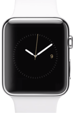

# Sidhant Ahluwalia 
## In-Class Assignment 

## 01/31/18

## Ontology 
The 3 topics of my choice include 3 Apple devices that all use IOS as the mobile operating system. Each of the topics have a touch screen and use the apple ecosystem to speak to each other. While each of them can do many similar tasks, such as play music or browse the web, they are build with a specific perpose in mind, for Apple that purpose is Design.

## iPhone 

### Background

iPhone is a line of smartphones designed and marketed by Apple Inc. They run Apple's iOS mobile operating system. The first-generation iPhone was released on June 29, 2007, and there have been multiple new hardware iterations with new iOS releases since.

The original iPhone was described as "revolutionary" and a "game-changer" for the mobile phone industry. Newer iterations have also garnered praise, and the iPhone's success has been credited with helping to make Apple one of the world's most valuable publicly traded companies.

###  Description

The user interface is built around the device's multi-touch screen, including a virtual keyboard. The iPhone has Wi-Fi and can connect to cellular networks. An iPhone can shoot video (though this was not a standard feature until the iPhone 3GS), take photos, play music, send and receive email, browse the web, send and receive text messages, follow GPS navigation, record notes, perform mathematical calculations, and receive visual voicemail. Other functionality, such as video games, reference works, and social networking, can be enabled by downloading mobile apps. As of January 2017, Apple's App Store contained more than 2.2 million applications available for the iPhone.

### History 

Apple has released eleven generations of iPhone models, each accompanied by one of the eleven major releases of the iOS operating system. The original first-generation iPhone was a GSM phone and established design precedents, such as a button placement that has persisted throughout all releases and a screen size maintained for the next four iterations. The iPhone 3G added 3G network support, and was followed by the 3GS with improved hardware, the 4 with a metal chassis, higher display resolution and front-facing camera, and the 4S with improved hardware and the voice assistant Siri. 

## iPad

### Background

iPad is a line of tablet computers designed, developed and marketed by Apple Inc., which run the iOS mobile operating system. An iPad can shoot video, take photos, play music, and perform Internet functions such as web-browsing and emailing. Other functions – games, reference, GPS navigation, social networking, etc. – can be enabled by downloading and installing apps. As of March 2016, the App Store has more than one million apps for the iPad by Apple and third parties.

###  Description

The most recent iPad models are the iPad (2017), released on March 24, 2017, the 10.5-inch (270 mm) and 12.9-inch (330 mm) 2G iPad Pro released on June 13, 2017. The user interface is built around the device's multi-touch screen, including a virtual keyboard. All iPads can connect via Wi-Fi; some models also have cellular connectivity.

### History 

The first iPad was released on April 3, 2010; the most recent iPad models are the iPad (2017), released on March 24, 2017, the 10.5-inch (270 mm) and 12.9-inch (330 mm) 2G iPad Pro released on June 13, 2017. As of January 2015, Apple had sold more than 250 million iPads, though sales peaked in 2013 and it is now the second-most popular kind of tablet computer, by sales, after Android-based types.

## Apple Watch

### Background

Apple Watch is a line of smartwatches designed, developed and marketed by Apple Inc. It incorporates fitness tracking and health-oriented capabilities with integration with iOS and other Apple products and services. The first generation watch was available in four variants: Apple Watch Sport, Apple Watch, Apple Watch Hermès, and Apple Watch Edition; each was distinguished by different combinations of cases and first- or third-party interchangeable bands.

### Description

Apple Watch (excluding Series 3 LTE) relies on a wirelessly connected iPhone to perform many of its default functions such as calling and texting. The first generation watches are compatible with iPhone 5 or later models running iOS 8.2 or later, through the use of Wi-Fi or Bluetooth.

### History 

The Apple Watch was released on April 24, 2015 and quickly became the best-selling wearable device with 4.2 million sold in the second quarter of the 2015 fiscal year.

The Apple Watch Series 2 was released on September 2016, along with the Apple Watch Series 1.[13]

The Apple Watch Series 3 was released on September 22, 2017.

*Sources* 

1. [Wikipedia iPhone](https://en.wikipedia.org/wiki/IPhone)
2. [Wikipedia iPad](https://en.wikipedia.org/wiki/IPad)
3. [Wikipedia Apple Watch](https://en.wikipedia.org/wiki/Apple_Watch)
