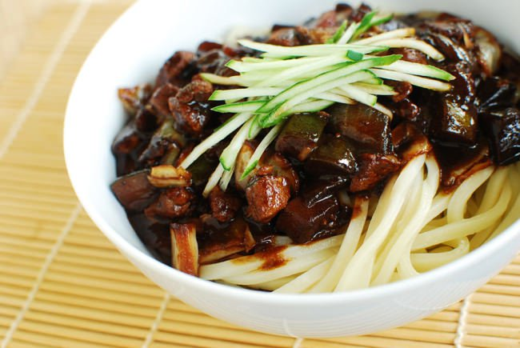
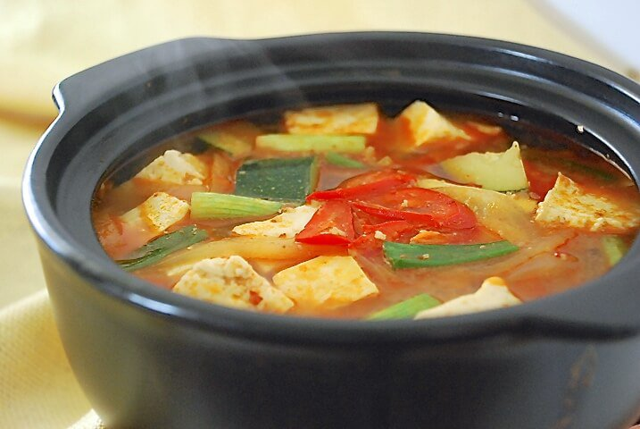
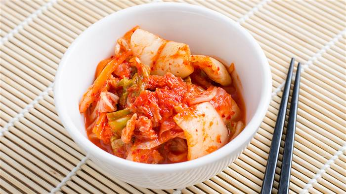

# Korean Delicacy

May Shin Lyan

In-class exercise 5: Information Architecture and Markdown

Jan 31st 2018

## What's cool about Korean Delicacy?

Korean cuisine has evolved through centuries of social and political change. Originating from ancient agricultural and nomadic traditions in the Korean peninsula and southern Manchuria, Korean cuisine has evolved through a complex interaction of the natural environment and different cultural trends.

Korean cuisine is largely based on rice, vegetables, and meats. Traditional Korean meals are noted for the number of side dishes (반찬; banchan) that accompany steam-cooked short-grain rice. Kimchi is served at nearly every meal. Commonly used ingredients include sesame oil, doenjang (fermented bean paste), soy sauce, salt, garlic, ginger, pepper flakes, gochujang (fermented red chili paste) and napa cabbage.

Ingredients and dishes vary by province. Many regional dishes have become national, and dishes that were once regional have proliferated in different variations across the country. Korean royal court cuisine once brought all of the unique regional specialties together for the royal family. Foods are regulated by Korean cultural etiquette.

## Three Main Pillars of Korean Delicacy

### 1. Jajangmyeon

Jajang (자장; alternately spelled jjajang 짜장) derived from the Chinese word zhájiàng (炸酱), which means "fried sauce". Myeon (면) means "noodles". The Chinese characters are pronounced jak (작; 炸) and jang (장; 醬) in Korean, but the noodle dish is called jajangmyeon, not jakjangmyeon, because its origin is not the Sino-Korean word, but the transliteration of the Chinese pronunciation. As the Chinese pronunciation of zhá sounded like jja (rather than ja) to Korean ears, the dish has been known in South Korea as jjajangmyeon, and the vast majority of Korean Chinese restaurants use this spelling.

However, until 22 August 2011, National Institute of Korean Language did not recognize the spelling as a solidified idiomatic transliteration. Later jjajangmyeon was accepted as an alternate standard spelling alongside the existing jajangmyeon in the National Language Deliberation Council, and on August 31, it was announced as a standard spelling and included in the Standard Korean Language Dictionary.[3] The reason jjajangmyeon did not become the standard spelling was due to the transliteration rules for foreign words announced in 1986 by the Ministry of Education, which stated that the foreign obstruents should not be transliterated using doubled consonants except for some established usages.[4]

One of the ardent supporter of the spelling jjajangmyeon was Ahn Do-hyeon, the Sowol Poetry Prize winning poet. In the cartoon Sikgaek and the newspapaer The Hankyoreh, the poet associated the name jjajangmyeon with double consonant with all his childhood memories of the dish.[citation needed], insisting that the sound of jja (with fortis consonant) makes the smell of jjajangmyeon, which was soaked in people's memory, stimulate their noses more profoundly and aggressively, and the power of jjajangmyeon comes from the power spread by its smell.[5] He also wrote a book of essays titled jjajangmyeon, insisting he never saw a Korean Chinese restaurant selling jajangmyeon (spelled with single j).

### 2. Doenjang-jjigae aka Soybean paste stew

Stews are referred to as jjigae, and are often a shared side dish. Jjigae is often both cooked and served in the glazed earthenware pot (ttukbaegi) in which it is cooked. The most common version of this stew is doenjang jjigae, which is a stew of soybean paste, with many variations; common ingredients include vegetables, saltwater or freshwater fish, and tofu. The stew often changes with the seasons and which ingredients are available. Other common varieties of jjigae contain kimchi (kimchi jjigae) or tofu (sundubu jjigae).

Doenjang-jjigae or soybean paste stew is a rich, silky jjigae (stew) made with doenjang (soybean paste) and available ingredients such as vegetables (scallions, aehobak, radishes, potatoes, chili pepper), mushrooms, tofu, seafood (shrimp, clams) and meat (beef, pork).[2] Often, small amount of gochujang (red chili paste) is added for a hint of heat.[3] It is one of Korea's most-popular jjigae, served from breakfast to late-night.[4] It is heartier, thicker and more pungent compared to doenjang-guk (soybean paste soup).

### 3. Kimchi!!!

Kimchi (/ˈkɪmtʃiː/; Korean: 김치, translit. gimchi, IPA: [kim.tɕʰi]), a staple in Korean cuisine, is a traditional side dish made from salted and fermented vegetables, most commonly napa cabbage and Korean radishes, with a variety of seasonings including chili powder, scallions, garlic, ginger, and jeotgal (salted seafood). There are hundreds of varieties of kimchi made with different vegetables as the main ingredients.[3][4] In traditional preparations, kimchi was stored underground in jars to keep cool, and unfrozen during the winter months.[2] With the rise of technology, kimchi refrigerators are more commonly used to make kimchi.

The origin of kimchi dates back at least to the early period of the Three Kingdoms (37 BC‒7 AD).[19] Fermented foods were widely available, as the Records of the Three Kingdoms, a Chinese historical text published in 289 AD, mentions that "The Goguryeo people [referring to the Korean people] are skilled in making fermented foods such as wine, soybean paste, and salted and fermented fish" in the section named Dongyi in the Book of Wei.[20][21] Samguk Sagi, a historical record of the Three Kingdoms of Korea, also mentions the pickle jar used to ferment vegetables, which indicates that fermented vegetables were commonly eaten during this time.

A poem on Korean radish written by Yi Gyubo, a 13th century literatus, shows that radish kimchi was a commonplace in Goryeo (918–1392).[4][23][24]

Pickled radish slices make a good summer side-dish,
Radish preserved in salt is a winter side-dish from start to end.
The roots in the earth grow plumper everyday,
Harvesting after the frost, a slice cut by a knife tastes like a pear.

— Yi Gyubo, Dongguk isanggukjip (translated by Michael J. Pettid, in Korean cuisine: An Illustrated History)

## References

- https://en.wikipedia.org/wiki/Korean_cuisine#Kimchi
- https://en.wikipedia.org/wiki/Kimchi
- https://en.wikipedia.org/wiki/Doenjang-jjigae
- https://en.wikipedia.org/wiki/Jajangmyeon

